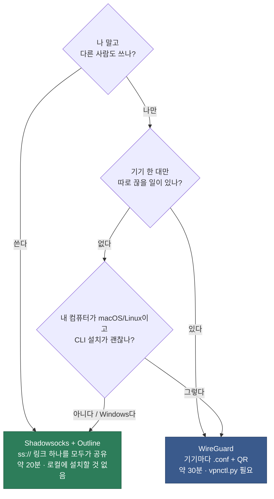
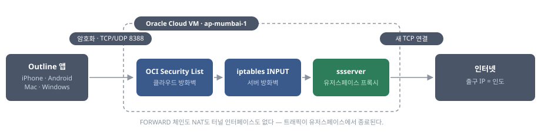
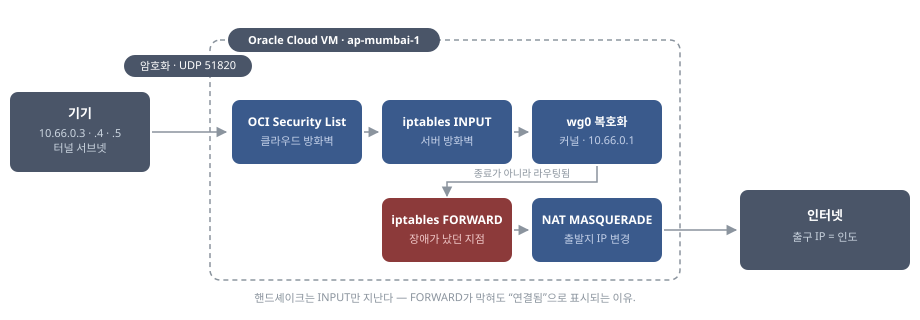

# oracle-vpn

[English](README.md) · **한국어**

Oracle Cloud Always Free 인스턴스로 만든 개인 VPN. 인도(뭄바이) IP로 나간다.
월 $0.

- 실측: 다운로드 38 Mbps · 업로드 5.8 Mbps · 지연 시간 230 ms (한국 → 뭄바이)
- 서버: `ap-mumbai-1` · VM.Standard.E2.1.Micro · Ubuntu 22.04

---

## 방식 선택




| | [**Shadowsocks + Outline**](shadowsocks/README.ko.md) | [**WireGuard**](wireguard/README.ko.md) |
|---|---|---|
| | **추천** | 기기별 제어 |
| 설치 시간 | 약 20분 | 약 30분 |
| 클라이언트 앱 | Outline | WireGuard |
| 자격증명 | `ss://` 링크 하나 | `.conf` 파일 또는 QR 이미지 |
| 기기 추가 | 같은 링크를 전달한다 | `vpnctl.py add` 를 실행한다 |
| 폐기 | 전원의 키가 교체된다 | 기기 하나씩 폐기한다 |
| 내 컴퓨터에 필요한 것 | 없음 | `wireguard-tools`, Python |
| 설치 작업 가능 OS | macOS · Linux · **Windows** | macOS · Linux 만 |
| 종류 | 프록시 (모바일에서는 시스템 전역 VPN) | 풀 터널, 커널 수준 |
| 포트 | TCP + UDP 8388 | UDP 51820 |

둘 다 업로드한 init 스크립트로 첫 부팅 때 자동 설치된다. 포트가 다르므로 한 서버에서
동시에 운영해도 충돌하지 않는다.

**Windows에서는 Shadowsocks + Outline을 쓴다.** WireGuard는 설정을 발급할 관리 머신이
필요한데 그쪽이 macOS/Linux 전용이다.

---

## 목차

- [아키텍처](#아키텍처) — [Shadowsocks](#shadowsocks) · [WireGuard](#wireguard)
- [성능](#성능) — 실측치와 한계 요인
- [유지관리](#유지관리)

---

## 아키텍처

### [Shadowsocks](shadowsocks/README.ko.md)

유저스페이스 프록시다. 트래픽이 `ssserver` 프로세스에서 종료되고 프록시가 자기 이름으로
새 연결을 연다. 그래서 IP 전달이나 NAT를 전혀 거치지 않는다.



| | |
|---|---|
| 프로세스 | `ssserver` — shadowsocks-rust 정적 musl 빌드, Docker 없음 |
| 리스닝 | `0.0.0.0:8388` TCP **와** UDP |
| 설정 | `/etc/shadowsocks/config.json` |
| 암호군 | `chacha20-ietf-poly1305` (Outline은 최신 AEAD-2022 계열을 거부한다) |
| 자격증명 | 사전 공유 키 하나를 모든 클라이언트가 함께 쓴다 |
| 거치는 체인 | INPUT 뿐 |
| 메모리 | 약 6 MB |

돌아가는 서버에서 위 표를 확인하는 명령이다.

```bash
sudo systemctl is-active shadowsocks      # active
sudo ss -tulnp | grep 8388                # tcp 줄 하나, udp 줄 하나
sudo grep method /etc/shadowsocks/config.json
```

### [WireGuard](wireguard/README.ko.md)

커널 가상 인터페이스다. 복호화된 패킷을 호스트가 라우팅하므로 FORWARD 체인을 지나고
나가는 길에 NAT를 거친다.



| | |
|---|---|
| 인터페이스 | `wg0`, MTU 1280, 주소 `10.66.0.1/24` |
| 리스닝 | `0.0.0.0:51820` UDP |
| 설정 | `/etc/wireguard/wg0.conf`, 기기마다 `[Peer]` 블록 하나 |
| 자격증명 | 기기별 키 쌍. 개인키는 내 컴퓨터에서 생성된다 |
| 거치는 체인 | INPUT → FORWARD → NAT POSTROUTING |
| 커널 설정 | `net.ipv4.ip_forward=1` — 없으면 아무것도 라우팅되지 않는다 |

돌아오는 트래픽은 역순이다. conntrack이 NAT를 되돌리고, 다시 FORWARD를 지나,
`wg0`가 재암호화한다. 그래서 FORWARD는 나가는 `-i wg0`와 돌아오는 `-o wg0`
양쪽을 모두 허용해야 한다.

서버 쪽 피어는 `AllowedIPs = 10.66.0.X/32`로 자기 주소 하나에 고정되므로, 기기는 자기
주소 외에는 쓸 수 없다. 클라이언트는 `0.0.0.0/0`을 써서 모든 트래픽을 터널로 보낸다.

돌아가는 서버에서 위 표를 확인하는 명령이다.

```bash
sudo systemctl is-active wg-quick@wg0     # active
sudo ss -ulnp | grep 51820                # udp 줄 두 개 (IPv4 + IPv6)
sudo wg show                              # 피어, 마지막 핸드셰이크, 전송량
cat /proc/sys/net/ipv4/ip_forward         # 1 — 아니면 아무것도 라우팅되지 않는다
```

뒤 두 줄은 Shadowsocks에 대응하는 항목이 없다. 홉이 더 있다는 것이 곧 잘못될 여지다.

---

## 성능

fast.com 기준, 서울에서 WireGuard로 측정했다.

| 항목 | VPN 끔 | VPN 켬 |
|---|---|---|
| 다운로드 | 520 Mbps | **38 Mbps** |
| 업로드 | 160 Mbps | **5.8 Mbps** |
| 지연 시간 (유휴) | 5 ms | **230 ms** |
| 측정된 클라이언트 위치 | Seoul, KR | **Ghansoli, IN** |

- 지연 시간 5 → 230 ms: 뭄바이까지의 물리적 거리다. 설정으로 줄일 수 없고, 페이지가 굼떠 보이는 주된 이유다
- 다운로드 38 Mbps: 인스턴스 자체 회선이 약 56 Mbps라 사실상 상한에 가깝다
- 업로드 5.8 Mbps: 고지연 경로는 업로드가 가장 크게 깎인다. 대용량 업로드나 화상통화에는 부적합하다
- 암호화는 병목이 아니다. 이 CPU는 ChaCha20-Poly1305를 2.9 Gbps로 처리한다

---

## 유지관리

- Always Free 자원은 오래 유휴 상태면 회수될 수 있다. 며칠에 한 번은 접속하거나 콘솔에 로그인한다
- 무료 체험($300 / 30일)은 별개다. 체험이 끝나도 Always Free 자원은 남는다
