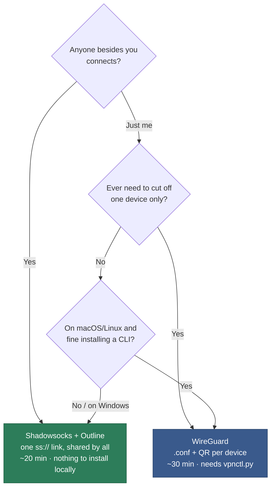
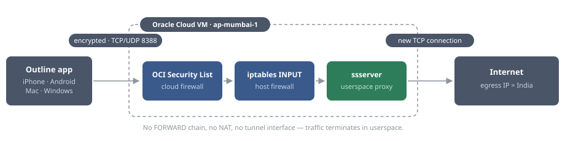
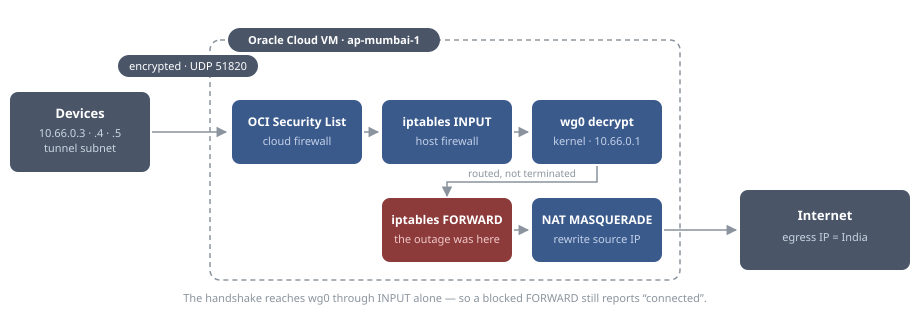

# oracle-vpn

**English** · [한국어](README.ko.md)

Personal VPN on an Oracle Cloud Always Free instance. Exits with an Indian
(Mumbai) IP. $0/month.

- Measured: 38 Mbps down · 5.8 Mbps up · 230 ms latency (Korea to Mumbai)
- Server: `ap-mumbai-1` · VM.Standard.E2.1.Micro · Ubuntu 22.04

---

## Pick a method




| | [**Shadowsocks + Outline**](shadowsocks/README.md) | [**WireGuard**](wireguard/README.md) |
|---|---|---|
| | **recommended** | per-device control |
| Setup time | ~20 min | ~30 min |
| Client app | Outline | WireGuard |
| Credential | one `ss://` link | `.conf` file or QR image |
| Adding a device | send the same link | run `vpnctl.py add` |
| Revoking | rotates the key for everyone | one device at a time |
| Your machine needs | nothing | `wireguard-tools`, Python |
| Setup runs on | macOS · Linux · **Windows** | macOS · Linux only |
| Kind | proxy (system-wide VPN on mobile) | full tunnel, kernel-level |
| Port | TCP + UDP 8388 | UDP 51820 |

Both install themselves at first boot from an uploaded init script, and both can
run on the same server — different ports, no conflict.

**On Windows, use Shadowsocks + Outline.** WireGuard needs an admin machine to
issue configs, and that side is macOS/Linux only.

---

## Contents

- [Architecture](#architecture) — [Shadowsocks](#shadowsocks) · [WireGuard](#wireguard)
- [Performance](#performance) — measured numbers and what limits them
- [Maintenance](#maintenance)

---

## Architecture

### [Shadowsocks](shadowsocks/README.md)

A userspace proxy. Traffic terminates in the `ssserver` process, which opens its
own outbound connections — so it never touches IP forwarding or NAT.



| | |
|---|---|
| Process | `ssserver` — shadowsocks-rust, static musl build, no Docker |
| Listens on | `0.0.0.0:8388` TCP **and** UDP |
| Config | `/etc/shadowsocks/config.json` |
| Cipher | `chacha20-ietf-poly1305` (Outline rejects the newer AEAD-2022 ciphers) |
| Credential | one pre-shared key, shared by every client |
| Chains crossed | INPUT only |
| Resident memory | ~6 MB |

Confirm the table above on a running server:

```bash
sudo systemctl is-active shadowsocks      # active
sudo ss -tulnp | grep 8388                # one tcp line, one udp line
sudo grep method /etc/shadowsocks/config.json
```

### [WireGuard](wireguard/README.md)

A kernel virtual interface. Decrypted packets are routed by the host, so they
cross the FORWARD chain and get NAT'd on the way out.



| | |
|---|---|
| Interface | `wg0`, MTU 1280, address `10.66.0.1/24` |
| Listens on | `0.0.0.0:51820` UDP |
| Config | `/etc/wireguard/wg0.conf`, one `[Peer]` block per device |
| Credential | a keypair per device; private keys are generated on your machine |
| Chains crossed | INPUT → FORWARD → NAT POSTROUTING |
| Kernel flag | `net.ipv4.ip_forward=1` — without it nothing is routed |

Return traffic reverses the path: conntrack undoes NAT, crosses FORWARD again,
then `wg0` re-encrypts. So FORWARD must allow both directions —
`-i wg0` outbound and `-o wg0` on the way back.

Each peer is pinned to `AllowedIPs = 10.66.0.X/32` on the server, so a device can
only ever use its own address. Clients set `0.0.0.0/0`, sending everything
through the tunnel.

Confirm the table above on a running server:

```bash
sudo systemctl is-active wg-quick@wg0     # active
sudo ss -ulnp | grep 51820                # two udp lines (IPv4 + IPv6)
sudo wg show                              # peers, last handshake, transfer
cat /proc/sys/net/ipv4/ip_forward         # 1 — otherwise nothing is routed
```

The last two have no Shadowsocks equivalent: the extra hops are what there is
to get wrong.

---

## Performance

fast.com, measured from Seoul over WireGuard.

| Metric | VPN off | VPN on |
|---|---|---|
| Download | 520 Mbps | **38 Mbps** |
| Upload | 160 Mbps | **5.8 Mbps** |
| Latency (unloaded) | 5 ms | **230 ms** |
| Client location reported | Seoul, KR | **Ghansoli, IN** |

- Latency 5 → 230 ms: physical distance to Mumbai. Cannot be tuned away; the main reason pages feel sluggish
- 38 Mbps down: the instance's own link is ~56 Mbps, so this is near the ceiling
- 5.8 Mbps up: high-latency paths hit upload hardest. Not for large uploads or video calls
- Encryption is not the bottleneck: this CPU does ChaCha20-Poly1305 at 2.9 Gbps

---

## Maintenance

- Always Free resources can be reclaimed after long idle periods — connect, or sign into the console, every few days
- The Free Trial ($300 / 30 days) is separate; Always Free resources survive its end
